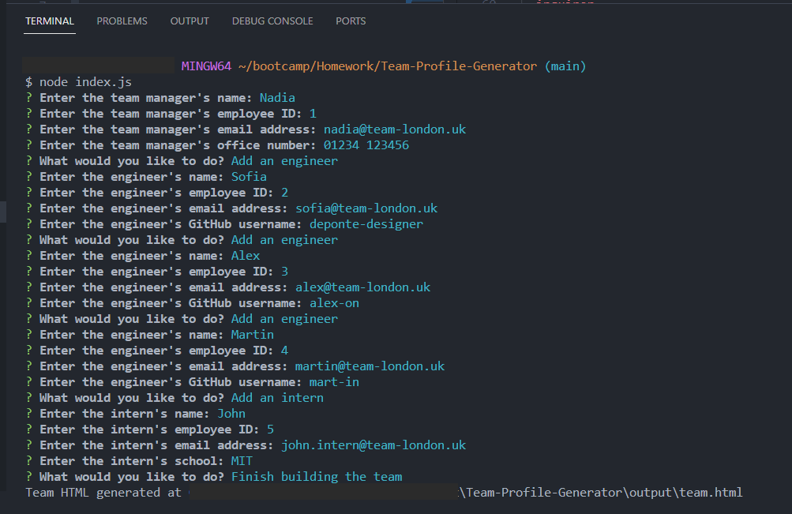

# Team-Profile-Generator

## Description
This project is a Test-Driven Development: Team Profile Generator designed to streamline the process of creating a team's profile. It employs object-oriented programming principles and interactive command-line prompts to collect information about team members and generate an HTML file for easy visualization. The primary technologies and tools used in this project include: JavaScript (JS), Node.js, Inquirer.js and Jest.

## Table of Contents
- [User Story](#user-story)
- [Installation](#installation)
- [Screenshots](#screenshots)
- [Usage](#usage)
- [Credits](#credits)
- [Deployment](#deployment)
- [How to Contribute](#how-to-contribute)
  - [Contributions](#contributions)
  - [Starred Project](#starred-project)
- [Tests](#tests)
- [Questions](#questions)
- [License](#license)
- [Badges](#badges)

## User Story
**As A** developer,  
**I WANT** a tool to generate a team profile,  
**SO THAT** I can easily organize and view information about my team members.

## Installation
Users can install the project by cloning the repository from GitHub and follow these steps to install the required dependencies:

1. Initialize the project:
```bash
npm init -y
```
2. Install Inquirer for user prompts:
```bash
npm i inquirer@6.3.1
```
3. Install Jest for testing:
```bash
npm i jest
```
4. Update test script in package.json:
Edit the `"test"` script in the `package.json` file (line 10) to use Jest
```bash
"test": "jest"
```
5. Run tests:
```bash
npm run test
```
6. Create .gitignore file:
Create a file named `.gitignore` to specify files and directories that should be ignored by Git. Add the following line to ignore the `node_modules` folder:
```bash
node_modules
```

## Screenshots

*The screenshot illustrate the command-line interaction with the Team Profile Generator application.*

## Usage

To use the Team Profile Generator, run the command `node index.js` in the terminal. Follow the prompts to provide information about your team, and the generator will create the `team.html` file based on your input.

1. Run the application:
```bash
node index.js
```
If you need you can:
1. Stop the application:
```bash
^C
```
2. Clear the terminal:
```bash
clear
```

## Credits
* [Jestjs.io](https://jestjs.io/)
* [Professional README Guide](https://coding-boot-camp.github.io/full-stack/github/professional-readme-guide) 
* [Badges Documentation by Shields.io](https://shields.io/docs/logos)

## Deployment
> This project is deployed and accessible at the following URLs:
> 
> - [GitHub Repository](https://github.com/deponte-designer/Team-Profile-Generator "Team-Profile-Generator GitHub Repository"): Visit the repository for project details, including a comprehensive README.
> - [Sample HTML](https://github.com/deponte-designer/Team-Profile-Generator/blob/main/output/team.html "The output HTML file"): Visit this link to view the team.html file generated using the application.

## How to Contribute
To contribute to this project, follow these steps:

1. Fork the repository.
2. Create a new branch for your feature (git checkout -b feature-name).
3. Commit your changes (git commit -m 'Add feature').
4. Push to the branch (git push origin feature-name).
5. Create a new pull request.

